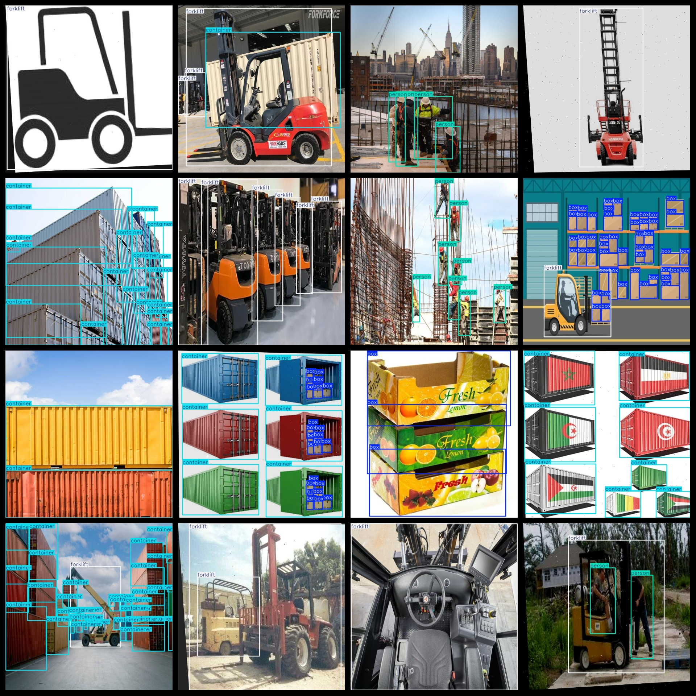

# Container Forklift Personnel Box Detection Dataset: A dataset of 5854 images in VOC+YOLO format for training and testing container forklift personnel box detection models.

Container Forklift Personnel Box Detection Dataset: 5854 images in VOC+YOLO format.

Dataset format: Pascal VOC format + YOLO format (excluding split paths in txt files, only containing jpg images along with corresponding VOC format xml files and YOLO format txt files).

Number of images (jpg file count): 5854

Number of annotations (xml file count): 5854

Number of annotations (txt file count): 5854

Number of annotation categories: 4

Repository: datasets_sl

Annotation category names (note that the order in the yolo format does not correspond to this, but follow the labels folder "classes.txt"): ["box", "container", "forklift", "person"]

Chinese translation of labels: "Box", "Container", "Forklift", "Person"

The number of boxes per category:

- box: 10,094
- container: 16,848
- forklift: 8,559
- person: 8,051
Total boxes: 43,552

The number of images per category:

- box: 714
- container: 1687
- forklift: 3,338
- person: 1,177

Image resolution: 640x640

Annotation tool used: labelImg

Dataset enhancement: No

Annotation rules: Draw a rectangle around the category

Important notice: The dataset does not have been divided into training, validation, or test sets; you need to do so yourself.

Special declaration: This dataset does not guarantee any accuracy of models trained or weight files.

Annotation and image details as follows:

## Images

---

Here is a pay link on Stripe (https://buy.stripe.com/3cs8yP7sY87d0vu9AB). Please contact me lonlonago@foxmail.com after funding $89, and I will send you a complete data files, thank you!

